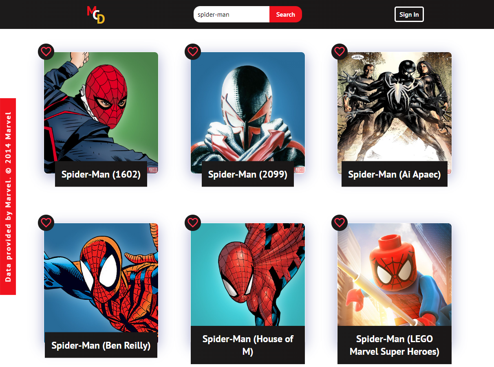

# [Marvel Characters Database](https://cozy-frangipane-4683ec.netlify.app/)

 

## The Idea
A `Fully Responsive` React App that fetches data from **The Marvel Comics API**, allowing users to search for or browse through all of Marvel Comic book characters. `Infinite Scroll` feature populates the homepage as a user scrolls down. `React Context` is used to let users sign-in. Once a user is signed-in, the user can save any characters to `Firestore` database backend by clicking the **Like** button. These **Liked** characters will show up on the user's **My Team** page. If the user is not signed-in, the **My Team** page will automatically redirect to **Authentication** page because **My Team** is a protected route (**Authentication** page becomes a protected route if the user is already signed-in). `React Router` is used for all routing. `Conditional Redndering` is used throughout the app.

### [Visit the Live Site](https://cozy-frangipane-4683ec.netlify.app/) 👈

## Technologies Used
`React Functional Components` `Custom Hooks` `React Router` `React Context` `Sass` `Firebase` `GIT`

 

# Tutorial

## Home Page

When you first visit the website you will land on the home page. There will be a small pop-up message briefly explaining the functions of the website.

 

## Infinite Scroll

If you scroll all the way to the bottom of the home page, more results will appear. And you can keep scrolling until you have seen all the Marvel Characters!

 

## Search Function

You can search for any Marvel Character by name. But the spelling has to be precise. Ex: "Ironman" will yeild no results, because Marvel uses the name "Iron Man". Also, searching by last name will yeild no results, make sure to start with the first part of the name. Ex: "Nick" instead of "Fury". Capitalization does not matter.

 

## Character Information Page

Clicking on any photo of a character will direct you to the profile page of that character, where you can find more information about them, including the number of Comics, Series, Stories they are involved in (20 of each will appear in the Character Information Page while you can click on the **More Info at Marvel** button to see the whole collection).

 

## Authentication Page

If you are not signed-in, top-right corner of the Navbar will show the **Sign In** button, clicking it will take you to **Authentication** Page, where you can choose to sign-in or sign-up. All Authentication is handled through **Firebase Authentication** so we will not be storing your password. You can also use a **Gmail** or **Github** account to sign-in. Signing-in is essencial for us to save your **Liked** characters to your profile. 

Once you are signed-in, **Authentication** page will be unavailable to you and you will be automatically redirected to the **Home** page. Also, the Navbar will no longer have the **Sign In** button and instead will have **My Team** and **Sign Out** buttons.

 

## Like Button

Only can be used if you are signed-in. Clicking the **Like** button on top-left of any character card will **Like** the character. If the character is already **Liked**, the button will show as such, and clicking the button now will remove the Like.

 

## My Team Page

Only can visit if you are signed-in. Traverse to this page by clicking the **My Team** button on the Navbar. All the characters you have **Liked** will show up here. You can remove them by hitting the **Liked** button again.

 
 
 

# Getting Started with Create React App

This project was bootstrapped with [Create React App](https://github.com/facebook/create-react-app).

## Available Scripts

In the project directory, you can run:

### `npm start`

Runs the app in the development mode.\
Open [http://localhost:3000](http://localhost:3000) to view it in your browser.

The page will reload when you make changes.\
You may also see any lint errors in the console.

### `npm test`

Launches the test runner in the interactive watch mode.\
See the section about [running tests](https://facebook.github.io/create-react-app/docs/running-tests) for more information.

### `npm run build`

Builds the app for production to the `build` folder.\
It correctly bundles React in production mode and optimizes the build for the best performance.

The build is minified and the filenames include the hashes.\
Your app is ready to be deployed!

See the section about [deployment](https://facebook.github.io/create-react-app/docs/deployment) for more information.

### `npm run eject`

**Note: this is a one-way operation. Once you `eject`, you can't go back!**

If you aren't satisfied with the build tool and configuration choices, you can `eject` at any time. This command will remove the single build dependency from your project.

Instead, it will copy all the configuration files and the transitive dependencies (webpack, Babel, ESLint, etc) right into your project so you have full control over them. All of the commands except `eject` will still work, but they will point to the copied scripts so you can tweak them. At this point you're on your own.

You don't have to ever use `eject`. The curated feature set is suitable for small and middle deployments, and you shouldn't feel obligated to use this feature. However we understand that this tool wouldn't be useful if you couldn't customize it when you are ready for it.

## Learn More

You can learn more in the [Create React App documentation](https://facebook.github.io/create-react-app/docs/getting-started).

To learn React, check out the [React documentation](https://reactjs.org/).

### Code Splitting

This section has moved here: [https://facebook.github.io/create-react-app/docs/code-splitting](https://facebook.github.io/create-react-app/docs/code-splitting)

### Analyzing the Bundle Size

This section has moved here: [https://facebook.github.io/create-react-app/docs/analyzing-the-bundle-size](https://facebook.github.io/create-react-app/docs/analyzing-the-bundle-size)

### Making a Progressive Web App

This section has moved here: [https://facebook.github.io/create-react-app/docs/making-a-progressive-web-app](https://facebook.github.io/create-react-app/docs/making-a-progressive-web-app)

### Advanced Configuration

This section has moved here: [https://facebook.github.io/create-react-app/docs/advanced-configuration](https://facebook.github.io/create-react-app/docs/advanced-configuration)

### Deployment

This section has moved here: [https://facebook.github.io/create-react-app/docs/deployment](https://facebook.github.io/create-react-app/docs/deployment)

### `npm run build` fails to minify

This section has moved here: [https://facebook.github.io/create-react-app/docs/troubleshooting#npm-run-build-fails-to-minify](https://facebook.github.io/create-react-app/docs/troubleshooting#npm-run-build-fails-to-minify)
